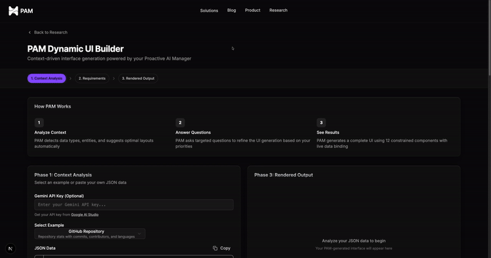

<p align="center">
  <h1 align="center">Generative Dynamic UI Builder</h1>
</p>

<p align="center">
  
</p>
<p>
    <i>
        Example: Sales dashboard generated from raw data
    </i>
</p>

<p align="center">
  <a href="https://manager.harmix.ai/research/generative-dynamic-ui?utm_source=github&utm_medium=referral&utm_campaign=own_media&utm_content=ui_interface">
    
  </a>
</p>

<p align="center">
  <a href="https://manager.harmix.ai/?utm_source=github&utm_medium=referral&utm_campaign=own_media&utm_content=ui_interface">
    
  </a>

  <a href="https://www.linkedin.com/company/harmix-proactive-ai-manager/posts/?feedView=all">
    
  </a>
</p>

<p align="center">
A constrained UI generation system where interfaces are built using only a predefined component library. The system evaluates context, gathers requirements through questions, then generates and evolves UIs predictably.
</p>

## Talk to our CTO

Email: [oleksandr@harmix.ai](mailto:oleksandr@harmix.ai)  
Schedule a meeting: [Book 30-minute call](https://calendly.com/oleksandr-harmix/30-minute-meeting)

---

## Features

- **Constrained Palette** - Limited to 12 components (no arbitrary HTML/CSS)
- **AI Domain Detection** - Automatically identifies data domain using Google Gemini
- **Auto-Configuration Generation** - Creates new domain patterns for unknown data types
- **Iterative Refinement** - Questions narrow down requirements before generation
- **Learning & Persistence** - Saves new configurations for future use
- **Context-Driven** - UI structure derived from input data shape
- **Persistent Evolution** - Changes are additive/predictable, not random rebuilds

---

## Tech Stack

| Category | Technology |
|----------|-----------|
| Framework | Next.js 16 (App Router) |
| Styling | TailwindCSS v4 |
| UI Components | Radix UI |
| Language | TypeScript |
| AI Provider | Google Gemini |

---

## Quick Start

```bash
# Install dependencies
pnpm install

# Set up AI analysis (optional - you can also pass API key directly in the UI)
# 1. Get a free API key from https://aistudio.google.com/apikey
# 2. Either pass it directly in the UI, or:
#    - Create .env.local file in the project root
#    - Add: NEXT_PUBLIC_GEMINI_API_KEY=your_api_key_here

# Run development server
pnpm dev

# Open http://localhost:3000
```

---

## API Key Setup

Get your free Google Gemini API key to enable AI-powered analysis:

1. Visit [Google AI Studio](https://aistudio.google.com/apikey) to get your API key
2. Choose one of two options:
   - **Pass directly in UI**: Enter your API key in the input field on the main page
   - **Use environment variable**: Create a `.env.local` file and add:
     ```
     NEXT_PUBLIC_GEMINI_API_KEY=your_api_key_here
     ```

Without an API key, the system falls back to local pattern matching.

---

## System Architecture

The system operates in 4 phases:

```
Input Context → Analyze → Questions → Generate → Render UI
```

### Phase 1: Context Analysis
- Parses input data (API response, file, URL)
- Identifies data types (metrics, lists, timelines, relationships)
- Determines primary entities and actions

### Phase 2: Requirement Gathering
- Generates 3-5 targeted questions based on context
- Questions cover: priority metrics, interaction needs, update frequency
- User answers shape component selection

### Phase 3: UI Generation
- Maps requirements to component combinations
- Generates layout structure using only allowed components
- Outputs as serializable JSON schema

### Phase 4: Rendering
- Dynamic renderer interprets the schema
- Resolves data bindings (`$data.path` syntax)
- Renders actual React components

---

## Component Library

### Layout Components
- **Container** - Grid wrapper with configurable columns
- **Card** - Content container with header/footer
- **Section** - Collapsible grouped content

### Data Display
- **Metric** - Single KPI with trend indicator
- **Table** - Tabular data with sorting
- **List** - Item collection with avatars
- **Chart** - Bar/line/pie visualizations

### Interactive
- **Button** - Action triggers
- **Filter** - Data filtering controls
- **Tabs** - View switching

### Status
- **Badge** - Status indicators
- **Progress** - Completion states

---

## Project Structure

```
├── app/                    # Next.js app directory
│   ├── page.tsx           # Demo page
│   └── globals.css        # Global styles
├── common/                # Core logic
│   ├── analyzer.ts        # Context analysis
│   ├── generator.ts       # Schema generation
│   ├── components.ts      # Component definitions
│   └── demo.ts           # Demo examples
├── components/
│   ├── DynamicRenderer.tsx # Schema → React renderer
│   └── ui/               # UI component library
├── lib/
│   ├── dataBinding.ts    # Data resolution utilities
│   └── utils.ts          # Utility functions
└── dynamic-ui-plan.md    # Detailed system plan
```

---

## Example Usage

```typescript
import { analyzeContext } from '@/common/analyzer'
import { generateUI } from '@/common/generator'
import { DynamicRenderer } from '@/components/DynamicRenderer'

// 1. Define context
const context = {
  type: 'github_repo',
  data: {
    stars: 1247,
    forks: 89,
    recent_commits: [...]
  }
}

// 2. Analyze context
const analysis = analyzeContext(context)

// 3. Answer questions
const answers = {
  priority: 'Overview metrics',
  list_actions: 'Quick actions'
}

// 4. Generate UI schema
const schema = generateUI(context, analysis, answers)

// 5. Render
<DynamicRenderer schema={schema} data={context.data} />
```

---

## Data Binding

The system supports dynamic data binding:

```json
{
  "component": "Metric",
  "props": {
    "label": "Stars",
    "value": "$data.stars"
  }
}
```

Supported patterns:
- `$data.path` - Bind to context data
- `$item.field` - Bind to list item (in loops)
- Nested paths: `$data.user.profile.name`

---

## Development

```bash
# Run linter
pnpm lint

# Build for production
pnpm build

# Start production server
pnpm start
```

---

## Key Features

- ✅ Type-safe schema validation
- ✅ Error boundaries for failed renders
- ✅ Responsive layouts
- ✅ Dark mode support
- ✅ Zero arbitrary HTML/CSS
- ✅ Predictable UI evolution
- ✅ Data binding system

---

## Learn More

See [`dynamic-ui-plan.md`](./dynamic-ui-plan.md) for the complete system design and philosophy.

---

## License

MIT
